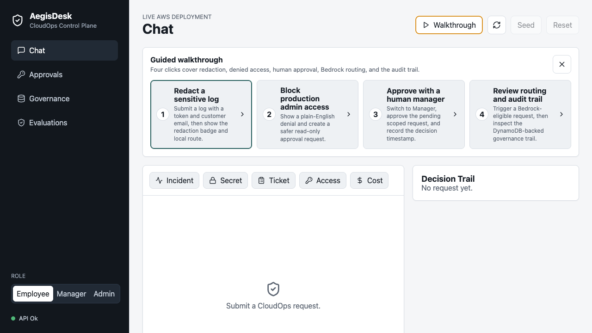
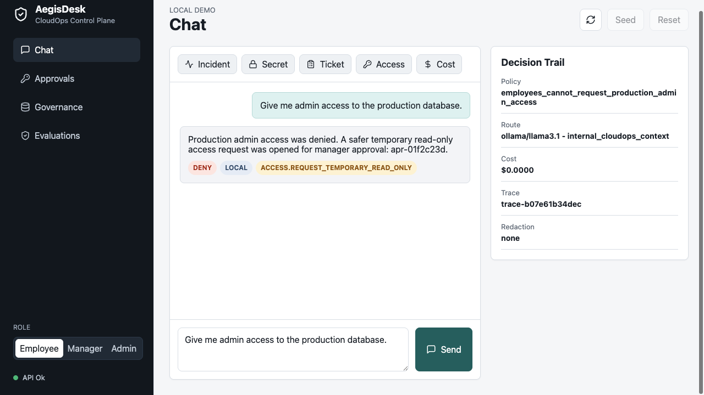
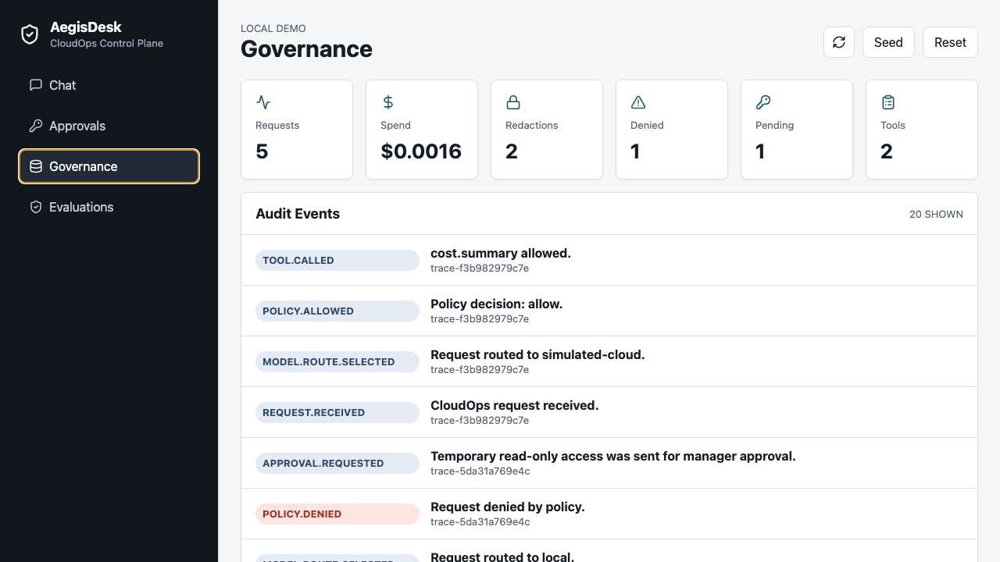
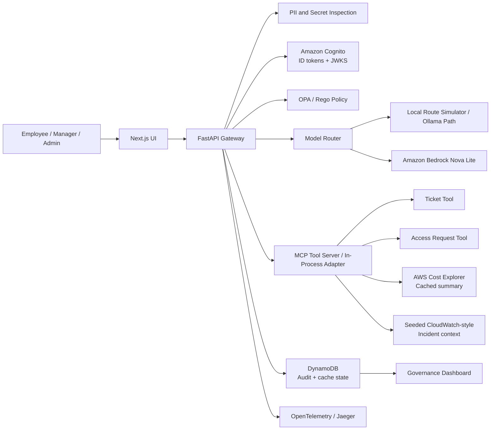

# AegisDesk CloudOps Control Plane

AegisDesk is a portfolio project for a policy-aware AI gateway in cloud operations. The goal is to show how an enterprise can let employees use AI for incident triage, access requests, ticket workflows, and cost investigation while enforcing privacy controls, role-based policy, model routing, approvals, audit logs, and cost visibility.

This repository includes a runnable and deployed portfolio slice: a Next.js frontend, FastAPI gateway, Amazon Cognito identity, live OPA/Rego policy enforcement, Amazon Bedrock routing with deterministic fallback, MCP tool server, DynamoDB-backed audit and cache state, AWS Cost Explorer integration, approvals, OpenTelemetry instrumentation, CI checks, Docker Compose, and low-cost AWS Terraform.

## About

Most AI chat projects stop at generating an answer. AegisDesk focuses on the enterprise layer around the answer: who is allowed to ask, what data can leave the environment, which model should handle the request, which tools can be called, what needs approval, what it costs, and how the decision is audited.

The product story is intentionally simple:

> Employees get AI help for cloud operations. The company keeps control over privacy, access, cost, and accountability.

Live deployment: [https://d27myiy7bbj1rz.cloudfront.net](https://d27myiy7bbj1rz.cloudfront.net)

Live API health: [https://c2wcg4cdef.execute-api.us-east-1.amazonaws.com/health](https://c2wcg4cdef.execute-api.us-east-1.amazonaws.com/health)

## Screenshots








## Target Users

- Cloud operations engineers triaging incidents and support requests
- Platform engineers building safe internal AI workflows
- Security and compliance reviewers auditing AI usage
- Engineering managers approving scoped operational actions
- FinOps teams tracking cloud and AI spend

## Core Use Cases

- **Cloud incident triage:** summarize seeded CloudWatch-style incident logs, detect secrets, search runbooks, and recommend next steps.
- **Access request governance:** deny unsafe production admin requests and route safer alternatives for approval.
- **Cost-aware model routing:** choose local or cloud models based on sensitivity, budget, and route policy.
- **Ticket automation:** create or check tickets through policy-gated MCP tools.
- **Governance dashboard:** filter audit events by request, user, policy decision, route, and tool call.
- **Guided walkthrough:** a four-step reviewer path shows redaction, policy denial, manager approval, Bedrock routing, and persisted audit evidence.

## Tech Stack

This is the current MVP stack and deployment shape:

| Area | Choice | Purpose |
| --- | --- | --- |
| Frontend | Next.js | Employee chat, manager approvals, admin dashboard |
| API | FastAPI, Pydantic | Gateway endpoints, schemas, OpenAPI contracts |
| Auth | Amazon Cognito Hosted UI, ID tokens, and JWKS verification | Visible login path plus backend-derived identity, role, and team claims |
| Policy | OPA/Rego in Lambda or HTTP, explicit Python fallback | Authorization, model routing, approval, and budget rules |
| AI routing | Amazon Bedrock Nova Lite, deterministic fallback, Ollama path documented | Shows real provider routing while preserving low-cost local review |
| Tooling | MCP Python SDK server plus Lambda in-process adapter | Ticket, access request, cost lookup, and runbook tools |
| Incident context | Seeded CloudWatch Logs-style source | Read-only operational evidence for incident triage without running log queries that add cost |
| Observability | OpenTelemetry instrumentation, structured logs, Jaeger path | Request-level debugging and review |
| Data | DynamoDB hosted state/cache, SQLite local fallback, Postgres path documented | Audit events, approvals, route history, quota counters, Cost Explorer cache, dashboard summaries |
| Runtime | direct local run, Docker Compose path, Lambda zip handler | Low-cost reproducible review |
| Cloud path | AWS Terraform with S3, CloudFront, Lambda, API Gateway, Cognito, DynamoDB, Bedrock IAM, Cost Explorer IAM, CloudWatch, Budget | Hosted portfolio deployment without always-on compute |
| CI/CD | GitHub Actions | API tests, evals, web build, OPA tests, MCP import, Terraform validate, container builds, manual AWS deploy |

## Engineering Highlights

- **Backend-enforced identity boundary:** protected API routes derive user, role, and team from Cognito ID token claims instead of trusting frontend role fields.
- **Visible Cognito login:** the hosted app supports Cognito Hosted UI sign-in with PKCE; reviewer persona shortcuts remain labeled as shortcuts for fast walkthroughs.
- **Policy outside the model:** OPA/Rego is the runtime policy path for tool use, access requests, routing, quotas, and approvals, with Python fallback only for direct local/test mode.
- **Real LLM path with cost control:** approved low-sensitivity prompts call Amazon Bedrock Nova Lite; sensitive, denied, or failed routes use deterministic/local fallback.
- **Real cost governance path:** manager/admin cost investigations call AWS Cost Explorer and cache results in DynamoDB to reduce repeated API calls.
- **Sensitive-data handling before model calls:** PII and secret detection run in the API before route selection.
- **Plain-English control explanations:** the UI explains policy and routing decisions in business language first, then shows technical policy IDs for review.
- **Auditable AI workflow:** each request produces events for redaction, route choice, policy result, incident context, tool call, approval, cost estimate, and trace ID.
- **Audit event explorer:** governance reviewers can filter persisted events by request ID, user, policy decision, model route, and tool.
- **Approval workflow evidence:** approval cards show requester, current status, approver identity, decision timestamp, and admin-only technical audit details.
- **Durable cloud state:** hosted audit events, approvals, model routes, metrics, and quota counters persist in DynamoDB.
- **Deployed AWS architecture:** Terraform provisions Cognito, a private S3 static site behind CloudFront, a FastAPI Lambda behind HTTP API Gateway, DynamoDB, Bedrock IAM, Cost Explorer access, least-privilege IAM, CloudWatch logs, short retention, encrypted static assets, lifecycle cleanup, and an AWS Budget guardrail.
- **Deployment automation:** a manual GitHub Actions deploy workflow builds the Lambda package, runs Terraform, publishes the static frontend, and invalidates CloudFront.
- **Safe portfolio boundaries:** destructive cloud actions are mocked or approval-only in the MVP, with a production hardening path documented separately.
- **Cloud role alignment:** the project emphasizes containers, policy-as-code, identity boundaries, observability, FinOps thinking, CI/CD, and deployable architecture.

## Architecture

The system is organized as a gateway between users, models, policies, tools, and audit storage.



Architecture docs:

- [Architecture Overview](docs/architecture.md)
- [System Architecture](docs/architecture/system-architecture.md)
- [API Contracts](docs/architecture/api-contracts.md)
- [Audit Event Model](docs/architecture/audit-event-model.md)
- [ADRs](docs/adrs/README.md)
- [Threat Model](docs/security/threat-model.md)
- [Governance Model](docs/security/governance-model.md)

## Current Status

Completed:

- Local Next.js frontend with Chat, Approvals, Governance, and Evaluations views
- FastAPI gateway with Cognito/JWKS auth, `/chat`, `/events`, `/approvals`, `/metrics/summary`, `/health`, `/health/live`, and `/health/ready`
- Cognito Hosted UI sign-in with backend OAuth code exchange and JWKS-verified ID tokens
- Redaction, policy decisions, model route metadata, approvals, governed tool calls, and audit events
- Cognito-backed persona tokens for the hosted portfolio environment
- Amazon Bedrock Nova Lite route for approved low-sensitivity prompts
- AWS Cost Explorer summaries for manager/admin cost investigations with DynamoDB caching
- Read-only incident context from a seeded CloudWatch Logs-style source for checkout latency triage
- DynamoDB-backed hosted audit/event state with SQLite local fallback
- Guided walkthrough for recruiter review
- Plain-English decision trail for policy, routing, approval, and redaction outcomes
- Audit event explorer with filters for request ID, user, decision, route, and tool
- Approval timeline showing pending counts, approver identity, timestamps, and correlated audit events
- Per-role/team quota counters and quota policy
- Real MCP server using the Python MCP SDK
- Admin-protected seed/reset actions for fast reviewer walkthroughs
- API tests, web build, OPA tests, Terraform validation, and container builds in GitHub Actions
- Deterministic control evals for redaction, routing, policy denial, approvals, and tool authorization
- Rego policy files and policy tests for chat, model routing, tool authorization, and approvals
- OpenTelemetry instrumentation and local Jaeger export path
- Docker Compose deployment shape with API, web, OPA, Jaeger, and persistent local API data
- Hosted AWS deployment using Cognito, private S3, CloudFront, API Gateway, Lambda, DynamoDB, Bedrock, Cost Explorer, CloudWatch, IAM, and AWS Budget
- Screenshots for recruiter review
- Product framing and target users
- Recruiter and hiring manager positioning
- Use cases and reviewer walkthrough script
- Architecture and API contracts
- Audit event model
- Governance and threat model
- Cost strategy and two-week MVP plan
- GitHub Actions validation
- Manual GitHub Actions AWS deploy workflow backed by S3 Terraform state

Next implementation milestone:

- Add a short walkthrough video
- Add an optional hosted login flow using Cognito Hosted UI instead of the current recruiter-friendly persona selector

## Repository Structure

```text
apps/web/                 Frontend app workspace
services/api/             Gateway API workspace
services/mcp-tools/       MCP tool server workspace
policies/                 OPA/Rego policy workspace
evals/                    Safety and policy evaluation workspace
infra/docker/             Local Docker runtime assets
infra/terraform/          AWS Terraform deployment path
infra/helm/               Optional Kubernetes packaging path
docs/product/             Product framing, users, use cases, reviewer script
docs/evidence/            Screenshots and reviewer walkthrough evidence
docs/architecture/        Detailed system docs, API contracts, audit model
docs/adrs/                Architecture decision records
docs/security/            Governance model and threat model
docs/delivery/            MVP plan, cost strategy, review checklist
```

## Local Run

The app runs locally and does not require cloud resources or paid model APIs.

API:

```bash
cd services/api
python3 -m venv .venv
.venv/bin/pip install -r requirements.txt
.venv/bin/uvicorn app.main:app --reload --port 8000
```

Web:

```bash
cd apps/web
npm install
npm run dev
```

Open `http://localhost:3000`.

Docker Compose path when Docker is available:

```bash
docker compose up --build
```

## Validation

Current CI verifies required docs, runs API tests, and builds the web app.

Local checks:

```bash
npm run build:web
npm run test:api
npm run evals
opa test policies
terraform -chdir=infra/terraform fmt -check
terraform -chdir=infra/terraform validate
git diff --check
```

## Market Signal

This project is aligned with current cloud and AI infrastructure demand:

- CNCF's 2026 cloud native survey reports Kubernetes as a foundation for production AI workloads, with 82% of container users running Kubernetes in production and 66% of organizations hosting generative AI models using Kubernetes for inference workloads.
- The FinOps Foundation's 2026 report identifies AI cost management as the top forward-looking FinOps skill and says 98% of respondents now manage AI spend.

Sources:

- https://www.cncf.io/announcements/2026/01/20/kubernetes-established-as-the-de-facto-operating-system-for-ai-as-production-use-hits-82-in-2025-cncf-annual-cloud-native-survey/
- https://data.finops.org/
