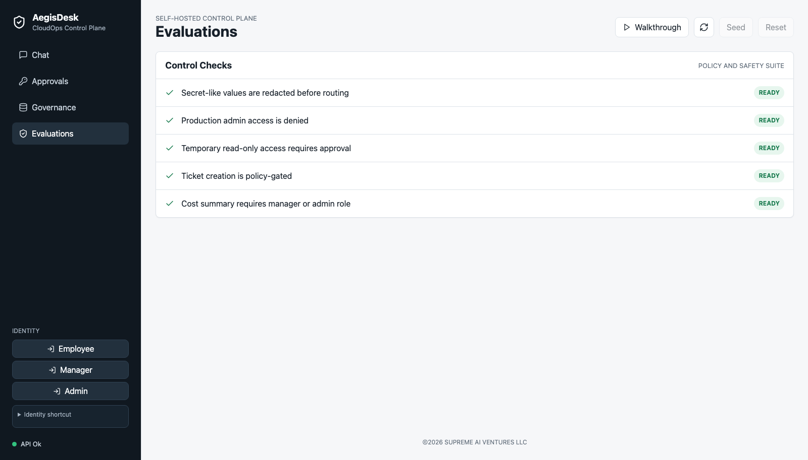
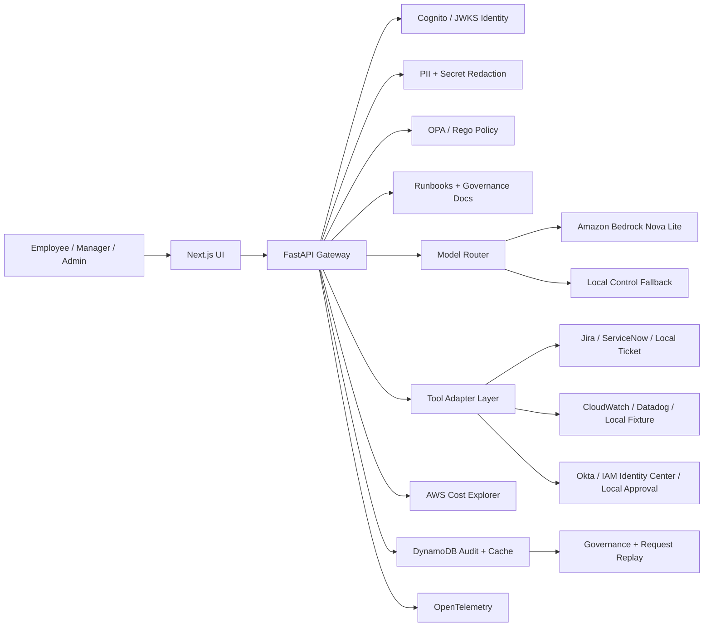

# AegisDesk CloudOps Control Plane

[](https://github.com/manynames3/aegisdesk-cloudops-control-plane/actions/workflows/ci.yml)

AegisDesk is a working self-hosted CloudOps AI control plane. It gives employees AI help for incidents, tickets, production access requests, and cloud cost questions while the backend enforces identity, redaction, OPA/Rego policy, approval gates, model routing, quotas, and audit trails.

## Quick Links

| Link | Purpose |
| --- | --- |
| [Live control plane](https://d27myiy7bbj1rz.cloudfront.net) | Try the working product UI |
| [Product page](https://d27myiy7bbj1rz.cloudfront.net/marketing) | Buyer-facing explanation and screenshots |
| [Live API health](https://c2wcg4cdef.execute-api.us-east-1.amazonaws.com/health) | Verify the deployed FastAPI gateway |
| [Documentation map](docs/README.md) | Find architecture, deployment, security, product, and sales docs |
| [Live operations evidence](docs/evidence/live-operations.md) | AWS deploy, logs, budget, and throttling evidence |
| [Self-hosted install](docs/deployment/self-hosted.md) | Run locally or deploy into AWS |

## What It Proves

This repo is built to demonstrate production-style CloudOps AI architecture, not just a chat UI:

- **Cloud architecture:** S3, CloudFront, Lambda, API Gateway, Cognito, DynamoDB, Bedrock, Cost Explorer, CloudWatch, Budget, and Terraform.
- **Governance controls:** OPA/Rego policy, role/team claims, quotas, approval workflows, request replay, and audit export.
- **Enterprise integration shape:** CloudWatch incident context, Jira and ServiceNow ticket adapters, MCP server, and adapter boundaries for Datadog, Okta, Entra, and IAM Identity Center.
- **Cost awareness:** local fallback, Bedrock kill switch, Cost Explorer cache, request limits, API throttling, and a low-idle-cost serverless deployment.
- **Delivery maturity:** GitHub Actions CI, Playwright smoke tests, API tests, OPA tests, MCP smoke test, Terraform validation, and manual-gated AWS deploy.

## About

Most employee-facing AI tools answer the prompt but leave the company with weak control over data, cost, access, and evidence. AegisDesk puts a governance layer between the user, the model, operational tools, and audit storage:

> Employees get faster CloudOps support. Platform, security, and FinOps teams keep control over who can ask, what data can leave, which model is used, which tools run, what needs approval, and how every decision is audited.

## Who It Is For

AegisDesk is designed for AWS-heavy platform, SRE, security, and FinOps teams that want employees to use AI during operational work without bypassing company controls. The strongest first workflow is governed CloudOps support: an operator asks about an incident, ticket, access request, or cost issue; AegisDesk applies identity, redaction, policy, source grounding, model routing, approval, and audit replay.

The likely buyer is a platform engineering or security leader who needs a self-hosted path, not a public chatbot, for operational AI use.

## Try The Core Workflow

1. Open the [live control plane](https://d27myiy7bbj1rz.cloudfront.net).
2. Use **Walkthrough** to run the four-step evaluation: redact a sensitive log, route scoped access for approval, approve as a manager, and inspect the governance trail.
3. Open **Governance** and click an audit event to review the request replay packet: prompt, sanitized prompt, policy input/output, model route, tool calls, sources, audit events, and trace ID.
4. Export the audit trail as JSON or CSV to show evidence that the workflow is reviewable outside the app.
5. Open the [product page](https://d27myiy7bbj1rz.cloudfront.net/marketing) for the buyer-facing explanation.

## Screenshots




## Evaluation Access And Production Mode

The hosted control plane supports two identity paths for evaluation:

1. **Cognito Hosted UI sign-in:** In the left sidebar, choose `employee`, `manager`, or `admin` under `Access`. The app prepares a non-production Cognito persona and shows the generated username and password in the `Temporary sign-in details` box. Copy those credentials, click `Open Hosted UI`, and sign in through AWS Cognito. After the callback, the sidebar should show `Cognito Hosted UI`, the signed-in user, role, and team.
2. **Evaluation shortcut:** Expand `Evaluation shortcut` for a faster walkthrough when you do not need to show the Hosted UI redirect. The backend still issues a controlled token and protected API routes derive identity, role, and team from token claims rather than trusting frontend fields.

The visible Cognito credentials are non-production evaluation personas (`aegisdesk-employee`, `aegisdesk-manager`, and `aegisdesk-admin`). They are generated from the hosted environment's persona seed, can be rotated by redeploying that seed, and are not personal credentials.

For a customer-facing deployment, disable evaluation access:

```bash
NEXT_PUBLIC_AEGISDESK_MODE=production
NEXT_PUBLIC_SHOW_EVALUATION_TOOLS=false
AEGISDESK_PERSONA_ISSUER_ENABLED=false
AEGISDESK_AUTH_MODE=cognito
```

Production mode hides evaluation-only controls, shows a company SSO entry point, avoids persona-token fallback in the browser, and the API rejects persona-token issuance when `AEGISDESK_PERSONA_ISSUER_ENABLED=false`.

## Product Use Cases

- **Incident triage:** attach read-only incident context, retrieve runbooks, redact secrets, and answer with cited operational guidance.
- **Ticket workflows:** create governed support tickets through adapter-backed tools.
- **Production access governance:** deny unsafe admin access, route safer scoped access requests for approval, and record before/after audit events.
- **Cloud cost review:** use AWS Cost Explorer summaries, DynamoDB caching, role-based access, quotas, and model-routing evidence.
- **AI governance review:** inspect policy input/output, redaction, model route, answer sources, tool calls, approvals, audit events, and trace IDs.
- **Audit evidence export:** export governance events for security review in JSON or CSV.
- **Agent interoperability:** expose governed CloudOps tools through an MCP server for agent clients such as Codex.

## Commercial Path

AegisDesk is best evaluated as a focused self-hosted pilot before a broad rollout. The recommended first pilot is one AWS CloudOps workflow with real identity, one operational integration, OPA policy, Bedrock routing, DynamoDB audit, and request replay.

Recommended pilot shape:

- **Buyer:** director of platform engineering, SRE leader, security engineering leader, or FinOps owner.
- **Initial workflow:** incident triage with ticket creation, scoped access approval, or cloud cost review.
- **Success metric:** faster operator response with evidence that sensitive data, model use, access requests, and audit records stayed under company control.
- **Commercial model:** paid pilot followed by a self-hosted annual license and integration support.

See the [buyer packet](docs/sales/buyer-readme.md), [product brief](docs/sales/product-brief.md), and [ROI model](docs/product/roi.md).

## Tech Stack

| Area | Choice | Purpose |
| --- | --- | --- |
| Frontend | Next.js | Chat, approvals, governance explorer, request replay, marketing page |
| API | FastAPI, Pydantic | Gateway endpoints, schemas, OpenAPI contracts |
| Auth | Amazon Cognito Hosted UI, ID tokens, JWKS verification | SSO-compatible identity boundary and role/team claims |
| Policy | OPA/Rego with explicit local fallback | Authorization, routing, quotas, approvals, and tool policy |
| AI routing | Amazon Bedrock Nova Lite, local control fallback, Ollama path documented | Approved low-sensitivity cloud route with cost controls |
| Tools | MCP Python SDK server plus API in-process adapter layer | Jira/ServiceNow/local ticketing, access, cost, incident context, and runbook tools |
| Knowledge | Markdown runbooks and governance policies | Source-grounded answers with owner and review date |
| Incident context | Local fixture provider, CloudWatch Logs adapter, Datadog adapter interface | Read-only operational evidence with bounded log queries |
| Observability | OpenTelemetry instrumentation, structured logs, Jaeger path | Request-level debugging and trace review |
| Data | DynamoDB hosted state/cache, SQLite local fallback | Audit events, approvals, route history, quota counters, Cost Explorer cache |
| Runtime | Docker Compose, direct local run, Lambda zip handler | Self-hosted local and AWS deployment paths |
| Cloud path | AWS Terraform | S3, CloudFront, Lambda, API Gateway, Cognito, DynamoDB, Bedrock IAM, Cost Explorer IAM, CloudWatch, Budget |
| CI/CD | GitHub Actions | API tests, evals, web build, OPA tests, MCP smoke test, Terraform validate, container builds, manual AWS deploy |

## Engineering Highlights

- **Backend-enforced identity:** protected routes derive user, role, and team from Cognito/JWKS-verified claims or controlled local persona tokens.
- **Policy outside the model:** OPA/Rego evaluates chat, tool, routing, quota, and approval rules before actions proceed.
- **Sensitive-data handling:** PII and secrets are redacted before model routing and before external model calls.
- **Real model and cost paths:** approved low-risk requests can call Amazon Bedrock Nova Lite; manager/admin cost reviews can call AWS Cost Explorer and cache results in DynamoDB.
- **Adapter-based integrations:** ticketing, incident context, and access request workflows are behind typed adapters; Jira ticket creation, ServiceNow ticket creation, and CloudWatch incident context are implemented behind env flags, while Datadog, Okta, and IAM Identity Center remain extension points.
- **MCP interoperability:** a Python MCP server exposes governed CloudOps tools for agent clients.
- **Request replay:** governance reviewers can inspect the prompt, sanitized prompt, policy input/output, model route, tool calls, answer sources, citations, audit events, and trace ID.
- **Audit retention and export:** manager/admin reviewers can export JSON/CSV evidence, while SQLite pruning and DynamoDB TTL keep the short-term audit window bounded.
- **Trusted source score:** every answer reports whether trusted sources were found, source freshness, external model use, sensitive external data status, and policy result.
- **Abuse and cost controls:** API Gateway throttling, prompt size limits, per-role quotas, Cost Explorer cache, and cloud-model kill switch are visible in product and Terraform configuration.
- **Low-cost cloud shape:** serverless AWS deployment uses no always-on compute and includes short log retention plus an AWS Budget guardrail.

## Architecture



Architecture and product docs:

- [Documentation Map](docs/README.md)
- [Architecture Overview](docs/architecture.md)
- [System Architecture](docs/architecture/system-architecture.md)
- [Integration Architecture](docs/integrations/README.md)
- [Self-Hosted Deployment](docs/deployment/self-hosted.md)
- [Security Overview](docs/security/security-overview.md)
- [Data Handling](docs/security/data-handling.md)
- [Landing Page Explanation](docs/product/landing-page.md)
- [Product Positioning](docs/product/positioning.md)
- [Buyer Personas](docs/product/buyer-personas.md)
- [CloudOps Use Cases](docs/product/use-cases-for-cloudops.md)
- [ROI Model](docs/product/roi.md)
- [Live Operations Evidence](docs/evidence/live-operations.md)
- [ADRs](docs/adrs/README.md)

## Current Capabilities

- Next.js frontend with Chat, Approvals, Governance, Evaluations, request replay, and `/marketing`
- FastAPI gateway with `/chat`, `/events`, `/requests/{request_id}/replay`, `/audit/export`, `/setup/status`, `/approvals`, `/metrics/summary`, `/health`, `/health/live`, and `/health/ready`
- Cognito Hosted UI sign-in, OAuth code exchange, and JWKS-verified ID token handling
- OPA/Rego policy enforcement for chat decisions, model routing, tool authorization, quotas, and approvals
- Bedrock Nova Lite route for approved low-sensitivity prompts with local control fallback
- AWS Cost Explorer summaries for manager/admin users with DynamoDB caching
- DynamoDB-backed hosted state with SQLite local fallback
- Local fixture incident context plus CloudWatch Logs Insights adapter, with Datadog as an extension point
- Local, Jira, and ServiceNow ticket adapters
- Playwright smoke tests for chat, approvals, governance replay, and audit export
- Access adapter interfaces for local approvals, Okta group requests, and IAM Identity Center
- MCP server for governed CloudOps tools
- Public setup-status endpoint with non-secret readiness checks
- Manager/admin audit export in JSON or CSV
- OpenTelemetry instrumentation and local Jaeger path
- Docker Compose runtime with API, web, OPA, Jaeger, and persistent local API data
- AWS Terraform for Cognito, CloudFront, S3, API Gateway, Lambda, DynamoDB, Bedrock IAM, Cost Explorer IAM, CloudWatch, and Budget
- GitHub Actions validation and manual AWS deploy workflow

## Repository Structure

```text
apps/web/                 Frontend app and marketing route
services/api/             FastAPI gateway, policy, adapters, auth, store, LLM routing
services/mcp-tools/       MCP tool server workspace
policies/                 OPA/Rego policy workspace
evals/                    Safety and policy evaluation workspace
infra/terraform/          AWS Terraform deployment path
infra/docker/             Local Docker runtime assets
infra/helm/               Optional Kubernetes packaging path
docs/product/             Product positioning, buyers, use cases, ROI
docs/security/            Security overview, data handling, governance, threat model
docs/deployment/          Self-hosted install and deployment path
docs/integrations/        Integration architecture and MCP notes
docs/sales/               Product brief, ROI calculator, buyer README, video script
docs/evidence/            Screenshots and walkthrough evidence
docs/knowledge/           Trusted runbooks and policies used for answer citations
docs/architecture/        System docs, API contracts, audit model
docs/adrs/                Architecture decision records
```

## Local Run

The fastest self-hosted path is Docker Compose:

```bash
cp .env.example .env
docker compose up --build
```

Open `http://localhost:3000`.

The default `.env.example` is configured for local evaluation. For a production-style deployment, set `NEXT_PUBLIC_AEGISDESK_MODE=production`, hide evaluation tools, disable persona issuance, and configure Cognito/JWKS identity before exposing the app to users.

Direct API and web run:

```bash
cd services/api
python3 -m venv .venv
.venv/bin/pip install -r requirements.txt
.venv/bin/uvicorn app.main:app --reload --port 8000
```

```bash
cd apps/web
npm install
npm run dev
```

See [Self-Hosted Deployment](docs/deployment/self-hosted.md) for required environment variables, AWS permissions, expected cost, auth setup, ticketing setup, and how to disable Bedrock.

## Validation

```bash
npm run build:web
npm run test:api
npm run test:e2e
npm run evals
npm run smoke:mcp
opa test policies
terraform -chdir=infra/terraform fmt -check
terraform -chdir=infra/terraform validate
git diff --check
```

CI runs the main checks plus container builds and Terraform validation.
