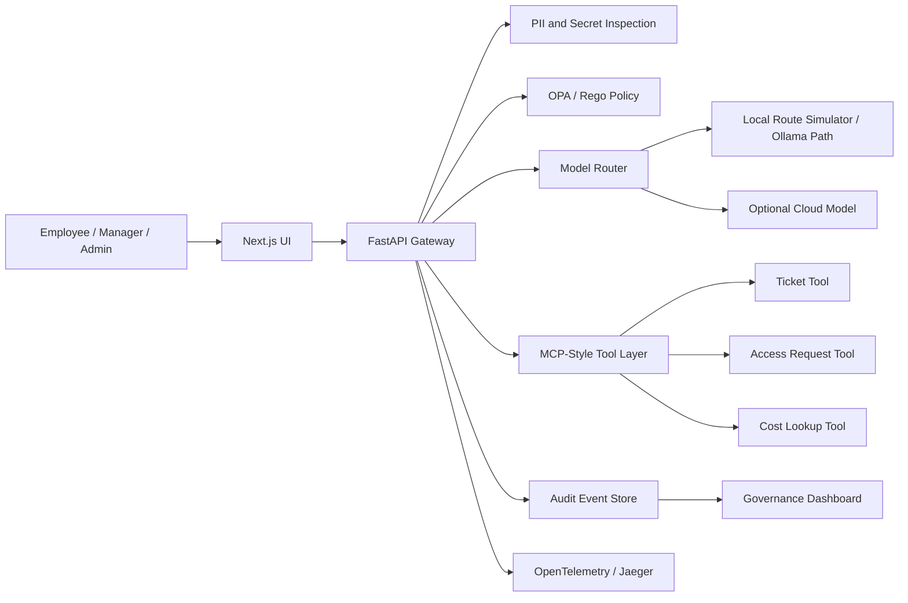

# AegisDesk CloudOps Control Plane

AegisDesk is a portfolio project for a policy-aware AI gateway in cloud operations. The goal is to show how an enterprise can let employees use AI for incident triage, access requests, ticket workflows, and cost investigation while enforcing privacy controls, role-based policy, model routing, approvals, audit logs, and cost visibility.

This repository now includes a local runnable MVP slice: a Next.js frontend, FastAPI gateway, deterministic policy/redaction/model-routing logic, mock MCP-style tools, approvals, audit events, Rego policy files, CI checks, and a Docker Compose deployment shape.

## About

Most AI demos stop at generating an answer. AegisDesk focuses on the enterprise layer around the answer: who is allowed to ask, what data can leave the environment, which model should handle the request, which tools can be called, what needs approval, what it costs, and how the decision is audited.

The demo is designed around a simple recruiter-friendly story:

> Employees get AI help for cloud operations. The company keeps control over privacy, access, cost, and accountability.

## Target Users

- Cloud operations engineers triaging incidents and support requests
- Platform engineers building safe internal AI workflows
- Security and compliance reviewers auditing AI usage
- Engineering managers approving scoped operational actions
- FinOps teams tracking cloud and AI spend

## Core Use Cases

- **Cloud incident triage:** summarize logs, detect secrets, search runbooks, and recommend next steps.
- **Access request governance:** deny unsafe production admin requests and route safer alternatives for approval.
- **Cost-aware model routing:** choose local or cloud models based on sensitivity, budget, and route policy.
- **Ticket automation:** create or check tickets through policy-gated MCP-style tools.
- **Governance dashboard:** show model usage, cost estimates, redactions, denied actions, approvals, and tool calls.

## Tech Stack

This is the current MVP stack and near-term deployment path:

| Area | Choice | Purpose |
| --- | --- | --- |
| Frontend | Next.js | Employee chat, manager approvals, admin dashboard |
| API | FastAPI, Pydantic | Gateway endpoints, schemas, OpenAPI contracts |
| Policy | OPA, Rego | Authorization, model routing, approval, and budget rules |
| AI routing | deterministic local route simulator, Ollama path documented | Shows routing decisions without paid model calls |
| Tooling | MCP-style Python tool layer | Ticket, access request, and cost lookup tools |
| Observability | trace IDs now, OpenTelemetry/Jaeger path documented | Request-level debugging and review |
| Data | SQLite MVP state, Postgres path documented | Audit events and dashboard summaries |
| Runtime | direct local run, Docker Compose path | Low-cost reproducible demo |
| Cloud path | Terraform/OpenTofu, Helm | Production deployment path without requiring always-on cloud spend |
| CI | GitHub Actions | Documentation checks now, implementation checks as code lands |

## Engineering Highlights

- **Policy outside the model:** OPA/Rego is the authority for tool use, access requests, routing, and approvals.
- **Local-first cost control:** the current demo does not call paid model providers or modify cloud resources.
- **Sensitive-data handling before model calls:** PII and secret detection run in the API before route selection.
- **Auditable AI workflow:** each request should produce events for redaction, route choice, policy result, tool call, approval, cost estimate, and trace ID.
- **Safe portfolio boundaries:** destructive cloud actions are mocked or approval-only in the MVP, with a production hardening path documented separately.
- **Cloud role alignment:** the project emphasizes containers, policy-as-code, identity boundaries, observability, FinOps thinking, CI/CD, and deployable architecture.

## Architecture

The system is organized as a gateway between users, models, policies, tools, and audit storage.



Architecture docs:

- [Architecture Overview](docs/architecture.md)
- [System Architecture](docs/architecture/system-architecture.md)
- [API Contracts](docs/architecture/api-contracts.md)
- [Audit Event Model](docs/architecture/audit-event-model.md)
- [ADRs](docs/adrs/README.md)
- [Threat Model](docs/security/threat-model.md)
- [Governance Model](docs/security/governance-model.md)

## Current Status

Completed:

- Local Next.js frontend with Chat, Approvals, Governance, and Evaluations views
- FastAPI gateway with `/chat`, `/events`, `/approvals`, `/metrics/summary`, and `/health`
- Redaction, policy decisions, model route metadata, approvals, mock tool calls, and audit events
- SQLite-backed local audit/event state
- Demo seed/reset actions for fast reviewer walkthroughs
- API tests and web build in GitHub Actions
- Deterministic control evals for redaction, routing, policy denial, approvals, and tool authorization
- Rego policy files for model routing, tool authorization, and approvals
- Docker Compose deployment shape
- Product framing and target users
- Recruiter and hiring manager positioning
- Use cases and demo script
- Architecture and API contracts
- Audit event model
- Governance and threat model
- Cost strategy and two-week MVP plan
- GitHub Actions validation

Next implementation milestone:

- Persist audit events in SQLite or Postgres
- Wire OPA runtime evaluation into the API instead of mirrored Python policy logic
- Add OpenTelemetry spans and Jaeger trace links
- Add Promptfoo or deterministic red-team evaluation fixtures
- Add screenshots and a short demo video

## Repository Structure

```text
apps/web/                 Frontend app workspace
services/api/             Gateway API workspace
services/mcp-tools/       MCP-style tool service workspace
policies/                 OPA/Rego policy workspace
evals/                    Safety and policy evaluation workspace
infra/docker/             Local Docker runtime assets
infra/terraform/          Optional cloud IaC path
infra/helm/               Optional Kubernetes packaging path
docs/product/             Product framing, users, use cases, demo spec
docs/architecture/        Detailed system docs, API contracts, audit model
docs/adrs/                Architecture decision records
docs/security/            Governance model and threat model
docs/delivery/            MVP plan, cost strategy, review checklist
```

## Local Run

The app runs locally and does not require cloud resources or paid model APIs.

API:

```bash
cd services/api
python3 -m venv .venv
.venv/bin/pip install -r requirements.txt
.venv/bin/uvicorn app.main:app --reload --port 8000
```

Web:

```bash
cd apps/web
npm install
npm run dev
```

Open `http://localhost:3000`.

Docker Compose path when Docker is available:

```bash
docker compose up --build
```

## Validation

Current CI verifies required docs, runs API tests, and builds the web app.

Local checks:

```bash
npm run build:web
npm run test:api
npm run evals
git diff --check
```

## Market Signal

This project is aligned with current cloud and AI infrastructure demand:

- CNCF's 2026 cloud native survey reports Kubernetes as a foundation for production AI workloads, with 82% of container users running Kubernetes in production and 66% of organizations hosting generative AI models using Kubernetes for inference workloads.
- The FinOps Foundation's 2026 report identifies AI cost management as the top forward-looking FinOps skill and says 98% of respondents now manage AI spend.

Sources:

- https://www.cncf.io/announcements/2026/01/20/kubernetes-established-as-the-de-facto-operating-system-for-ai-as-production-use-hits-82-in-2025-cncf-annual-cloud-native-survey/
- https://data.finops.org/
