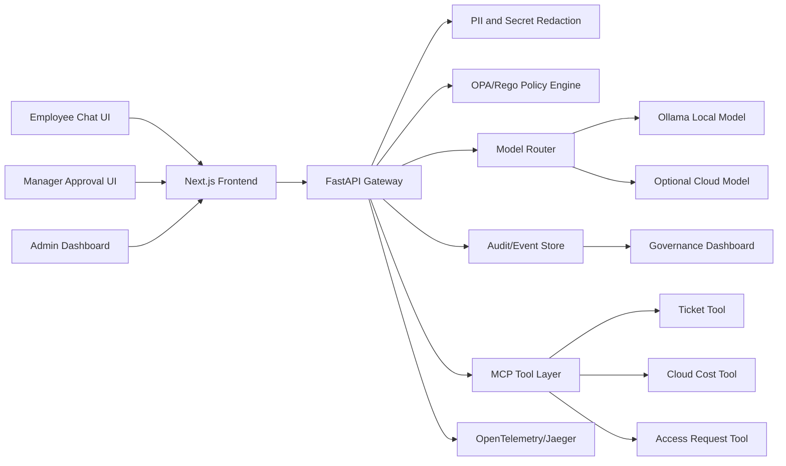

# AegisDesk CloudOps Control Plane

AegisDesk is a local-first, policy-aware AI gateway for cloud operations teams. It lets employees use AI for support, incident triage, access requests, and cloud cost investigation while the organization controls privacy, model routing, tool permissions, approvals, audit logs, and spend.

This is intentionally not just a chatbot. The project demonstrates the enterprise layer that companies need before they can safely let AI interact with cloud systems.

## One-Liner

A secure AI gateway for CloudOps workflows with OPA authorization, MCP tool interoperability, PII and secret protection, cost-aware model routing, approval workflows, audit logs, and cloud-native deployment artifacts.

## Why I Am Building This

Enterprise teams are adopting AI quickly, but they cannot simply tell employees to paste production logs, customer data, access requests, and incident details into public chat tools. They need a controlled front door for AI:

- Sensitive data must be detected before it leaves the environment.
- Users and agents must be restricted by role and policy.
- AI tool calls must be approved, denied, scoped, and audited.
- Model choice must account for sensitivity, latency, quality, and cost.
- Cloud and AI spend must be visible before it becomes waste.
- Leaders need evidence that controls are working, not just promises.

AegisDesk is built to show that I understand the cloud engineering problem behind enterprise AI adoption: useful AI has to be governed, observable, cost-aware, and deployable.

## Target End Users

Primary users:

- Cloud operations engineers
- Platform engineers
- IT support teams
- Security and compliance reviewers
- Engineering managers responsible for AI enablement
- FinOps teams tracking cloud and AI spend

Demo users:

- Employee requesting help
- Manager approving scoped actions
- Admin reviewing governance, cost, and audit events

## Recruiter-Friendly Demo Story

An employee asks AegisDesk for help with a cloud incident. The AI answers from approved internal knowledge, detects secrets in pasted logs, routes sensitive requests to a local model, blocks unsafe production access requests, requires manager approval for risky actions, and records every decision in an admin dashboard.

The visible story is simple:

> Employees get AI help. The company keeps control.

## Core Demo Use Cases

1. Cloud incident triage
   - User pastes an application error or log sample.
   - AegisDesk summarizes likely causes and suggests next steps.
   - Secrets are detected and redacted before model processing.

2. Access request governance
   - User asks for production database admin access.
   - OPA blocks the request and recommends read-only temporary access with manager approval.

3. AI cost-aware routing
   - Public, low-risk requests can use a cloud model.
   - Sensitive requests use local Ollama or are blocked.
   - Dashboard shows estimated cost, route reason, and budget impact.

4. Ticket and workflow automation
   - User asks AegisDesk to create or check a support ticket.
   - MCP-compatible tool calls are allowed or denied by policy.

5. Admin governance dashboard
   - Admin sees model usage, cost, redactions, policy decisions, tool calls, approvals, and evaluation results.

## Enterprise Value

AegisDesk demonstrates practical value in five areas:

- Risk reduction: prevent accidental sharing of secrets, PII, and privileged actions.
- Productivity: help CloudOps and support teams resolve common issues faster.
- Cost control: route requests based on sensitivity, budget, and model economics.
- Compliance readiness: provide audit trails, policy decisions, and evaluation reports.
- Platform maturity: package AI workflows as cloud-native services instead of ad hoc scripts.

## Planned MVP Architecture



## Initial Technology Choices

| Layer | MVP Choice | Why |
| --- | --- | --- |
| Frontend | Next.js | Recruiter-friendly demo UI and admin dashboard |
| API | FastAPI + Pydantic | Strong OpenAPI support and clear service boundaries |
| Local model | Ollama | Low-cost local-first demo |
| Optional cloud model | OpenAI-compatible provider via LiteLLM or adapter | Shows model routing without locking into one vendor |
| Policy | OPA/Rego | Real policy-as-code enforcement |
| Tools | MCP-compatible Python tools | Demonstrates agent/tool interoperability |
| Observability | OpenTelemetry + Jaeger | Shows request traces and operational maturity |
| Data | SQLite for MVP, Postgres path documented | Keeps local demo simple and production path clear |
| Runtime | Docker Compose | Reproducible demo at low cost |
| Cloud path | Terraform/OpenTofu + Helm | Shows infrastructure thinking without forcing paid cloud uptime |

## What This Project Is Designed To Prove

- I can turn an enterprise problem into a working cloud-native product.
- I can reason about security, cost, policy, and operations, not only UI or prompts.
- I understand that AI systems need controls before they touch production workflows.
- I can communicate tradeoffs clearly to technical and non-technical stakeholders.
- I can build a practical MVP while documenting the path to production.

## Repository Structure

```text
apps/web/                 Next.js frontend placeholder
services/api/             FastAPI gateway placeholder
services/mcp-tools/       MCP tool server placeholder
policies/                 OPA/Rego policy placeholder
evals/                    Evaluation and red-team test placeholder
infra/docker/             Docker Compose assets
infra/terraform/          Cloud IaC placeholder
infra/helm/               Kubernetes Helm placeholder
docs/product/             Product framing and use cases
docs/architecture/        Architecture and design decisions
docs/security/            Governance, threat model, security controls
docs/delivery/            MVP plan, demo checklist, cost strategy
```

## Current Status

Documentation scaffold is in place. Next implementation milestone is a local Docker Compose demo with:

- Working chat UI
- FastAPI gateway
- Mock MCP ticket/access/cost tools
- OPA policy decisions
- PII/secret redaction
- Audit event dashboard

## Market Signal

This project is aligned with current cloud and AI infrastructure demand:

- CNCF's 2026 cloud native survey reports that Kubernetes is now a foundation for production AI workloads, with 82% of container users running Kubernetes in production and 66% of organizations hosting generative AI models using Kubernetes for inference workloads.
- The FinOps Foundation's 2026 report identifies AI cost management as the top forward-looking FinOps skill and says 98% of respondents now manage AI spend.

Sources:

- https://www.cncf.io/announcements/2026/01/20/kubernetes-established-as-the-de-facto-operating-system-for-ai-as-production-use-hits-82-in-2025-cncf-annual-cloud-native-survey/
- https://data.finops.org/

