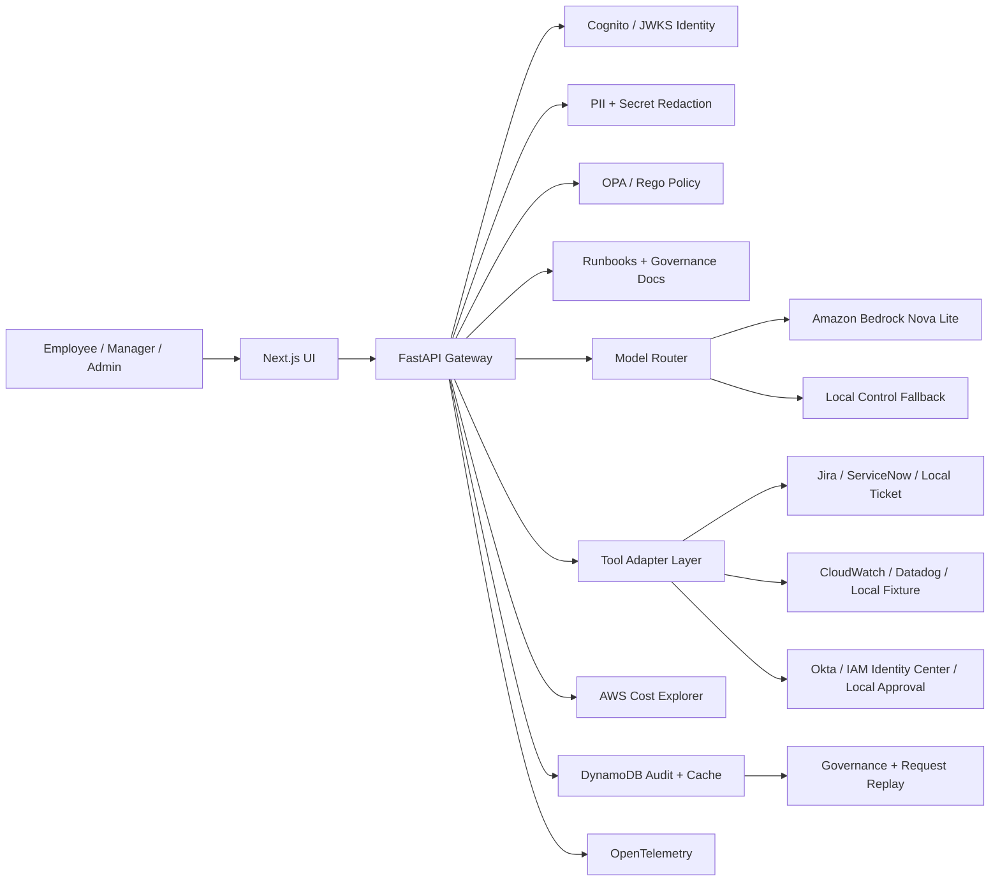

# AegisDesk CloudOps Control Plane

## TLDR

AegisDesk is a working, self-hosted CloudOps AI control plane for governed employee support. It combines a Next.js product UI, FastAPI gateway, Cognito/JWKS auth, OPA/Rego policy, Bedrock routing, DynamoDB audit storage, AWS Cost Explorer, MCP tools, Docker Compose, Terraform, and GitHub Actions OIDC deployment. The live AWS deployment shows the core enterprise story: employees can ask for incident, ticket, access, and cost help while the system enforces identity, redaction, approval gates, model routing, quotas, and audit trails.

- **Live app:** [https://d27myiy7bbj1rz.cloudfront.net](https://d27myiy7bbj1rz.cloudfront.net)
- **Product page:** [https://d27myiy7bbj1rz.cloudfront.net/marketing](https://d27myiy7bbj1rz.cloudfront.net/marketing)
- **Best reviewer path:** use the guided walkthrough to see secret redaction, denied production access, manager approval, Bedrock routing, DynamoDB audit events, and request replay.
- **Technical credibility:** real AWS infrastructure, keyless GitHub OIDC deploy, Cognito identity, runtime policy enforcement, live API, CI/CD, cost guardrails, and documented operations evidence.

AegisDesk is a self-hosted CloudOps AI control plane that gives employees AI help for incidents, tickets, production access requests, and cloud cost questions while enforcing identity, policy, redaction, approval, model routing, and audit trails. It is built as a full-stack reference implementation with a Next.js operator UI, FastAPI gateway, Cognito/JWKS identity, OPA/Rego policy enforcement, Bedrock routing, DynamoDB audit storage, AWS Cost Explorer integration, MCP tools, and Docker/Terraform deployment paths.

Live control plane: [https://d27myiy7bbj1rz.cloudfront.net](https://d27myiy7bbj1rz.cloudfront.net)

Marketing page: [https://d27myiy7bbj1rz.cloudfront.net/marketing](https://d27myiy7bbj1rz.cloudfront.net/marketing)

Live API health: [https://c2wcg4cdef.execute-api.us-east-1.amazonaws.com/health](https://c2wcg4cdef.execute-api.us-east-1.amazonaws.com/health)

## About

Most employee-facing AI tools answer the prompt but leave the company with weak control over data, cost, access, and evidence. AegisDesk puts a governance layer between the user, the model, operational tools, and audit storage:

> Employees get faster CloudOps support. Platform, security, and FinOps teams keep control over who can ask, what data can leave, which model is used, which tools run, what needs approval, and how every decision is audited.

## Screenshots


## Reviewer Access

The hosted control plane supports two identity paths:

1. **Cognito Hosted UI sign-in:** In the left sidebar, choose `employee`, `manager`, or `admin` under `Identity`. The app prepares a non-production Cognito persona and shows the generated username and password in the `Cognito credentials` box. Copy those credentials, click `Open Hosted UI`, and sign in through AWS Cognito. After the callback, the sidebar should show `Cognito Hosted UI`, the signed-in user, role, and team.
2. **Identity shortcut:** Expand `Identity shortcut` for a faster walkthrough when you do not need to show the Hosted UI redirect. The backend still issues a controlled token and protected API routes derive identity, role, and team from token claims rather than trusting frontend fields.

The visible Cognito credentials are non-production reviewer personas (`aegisdesk-employee`, `aegisdesk-manager`, and `aegisdesk-admin`). They are generated from the hosted environment's persona seed, can be rotated by redeploying that seed, and are not personal credentials.

## Product Use Cases

- **Incident triage:** attach read-only incident context, retrieve runbooks, redact secrets, and answer with cited operational guidance.
- **Ticket workflows:** create governed support tickets through adapter-backed tools.
- **Production access governance:** deny unsafe admin access, route safer scoped access requests for approval, and record before/after audit events.
- **Cloud cost review:** use AWS Cost Explorer summaries, DynamoDB caching, role-based access, quotas, and model-routing evidence.
- **AI governance review:** inspect policy input/output, redaction, model route, answer sources, tool calls, approvals, audit events, and trace IDs.
- **Agent interoperability:** expose governed CloudOps tools through an MCP server for agent clients such as Codex.

## Tech Stack

| Area | Choice | Purpose |
| --- | --- | --- |
| Frontend | Next.js | Chat, approvals, governance explorer, request replay, marketing page |
| API | FastAPI, Pydantic | Gateway endpoints, schemas, OpenAPI contracts |
| Auth | Amazon Cognito Hosted UI, ID tokens, JWKS verification | SSO-compatible identity boundary and role/team claims |
| Policy | OPA/Rego with explicit local fallback | Authorization, routing, quotas, approvals, and tool policy |
| AI routing | Amazon Bedrock Nova Lite, local control fallback, Ollama path documented | Approved low-sensitivity cloud route with cost controls |
| Tools | MCP Python SDK server plus API in-process adapter layer | Ticket, access, cost, incident context, and runbook tools |
| Knowledge | Markdown runbooks and governance policies | Source-grounded answers with owner and review date |
| Incident context | Local fixture provider with CloudWatch/Datadog adapter interfaces | Read-only operational evidence without requiring a customer's log source |
| Observability | OpenTelemetry instrumentation, structured logs, Jaeger path | Request-level debugging and trace review |
| Data | DynamoDB hosted state/cache, SQLite local fallback | Audit events, approvals, route history, quota counters, Cost Explorer cache |
| Runtime | Docker Compose, direct local run, Lambda zip handler | Self-hosted local and AWS deployment paths |
| Cloud path | AWS Terraform | S3, CloudFront, Lambda, API Gateway, Cognito, DynamoDB, Bedrock IAM, Cost Explorer IAM, CloudWatch, Budget |
| CI/CD | GitHub Actions | API tests, evals, web build, OPA tests, MCP smoke test, Terraform validate, container builds, manual AWS deploy |

## Engineering Highlights

- **Backend-enforced identity:** protected routes derive user, role, and team from Cognito/JWKS-verified claims or controlled local persona tokens.
- **Policy outside the model:** OPA/Rego evaluates chat, tool, routing, quota, and approval rules before actions proceed.
- **Sensitive-data handling:** PII and secrets are redacted before model routing and before external model calls.
- **Real model and cost paths:** approved low-risk requests can call Amazon Bedrock Nova Lite; manager/admin cost reviews can call AWS Cost Explorer and cache results in DynamoDB.
- **Adapter-based integrations:** ticketing, incident context, and access request workflows are behind typed adapters for local fixtures, Jira, ServiceNow, CloudWatch, Datadog, Okta, and IAM Identity Center.
- **MCP interoperability:** a Python MCP server exposes governed CloudOps tools for agent clients.
- **Request replay:** governance reviewers can inspect the prompt, sanitized prompt, policy input/output, model route, tool calls, answer sources, citations, audit events, and trace ID.
- **Trusted source score:** every answer reports whether trusted sources were found, source freshness, external model use, sensitive external data status, and policy result.
- **Abuse and cost controls:** API Gateway throttling, prompt size limits, per-role quotas, Cost Explorer cache, and cloud-model kill switch are visible in product and Terraform configuration.
- **Low-cost cloud shape:** serverless AWS deployment uses no always-on compute and includes short log retention plus an AWS Budget guardrail.

## Architecture



Architecture and product docs:

- [Architecture Overview](docs/architecture.md)
- [System Architecture](docs/architecture/system-architecture.md)
- [Integration Architecture](docs/integrations/README.md)
- [Self-Hosted Deployment](docs/deployment/self-hosted.md)
- [Security Overview](docs/security/security-overview.md)
- [Data Handling](docs/security/data-handling.md)
- [Landing Page Explanation](docs/product/landing-page.md)
- [Product Positioning](docs/product/positioning.md)
- [Buyer Personas](docs/product/buyer-personas.md)
- [CloudOps Use Cases](docs/product/use-cases-for-cloudops.md)
- [ROI Model](docs/product/roi.md)
- [Live Operations Evidence](docs/evidence/live-operations.md)
- [ADRs](docs/adrs/README.md)

## Current Capabilities

- Next.js frontend with Chat, Approvals, Governance, Evaluations, request replay, and `/marketing`
- FastAPI gateway with `/chat`, `/events`, `/events/replay/{request_id}`, `/approvals`, `/metrics/summary`, `/health`, `/health/live`, and `/health/ready`
- Cognito Hosted UI sign-in, OAuth code exchange, and JWKS-verified ID token handling
- OPA/Rego policy enforcement for chat decisions, model routing, tool authorization, quotas, and approvals
- Bedrock Nova Lite route for approved low-sensitivity prompts with local control fallback
- AWS Cost Explorer summaries for manager/admin users with DynamoDB caching
- DynamoDB-backed hosted state with SQLite local fallback
- Local fixture incident context with CloudWatch and Datadog adapter interfaces
- Ticket adapter interfaces for local, Jira, and ServiceNow workflows
- Access adapter interfaces for local approvals, Okta group requests, and IAM Identity Center
- MCP server for governed CloudOps tools
- OpenTelemetry instrumentation and local Jaeger path
- Docker Compose runtime with API, web, OPA, Jaeger, and persistent local API data
- AWS Terraform for Cognito, CloudFront, S3, API Gateway, Lambda, DynamoDB, Bedrock IAM, Cost Explorer IAM, CloudWatch, and Budget
- GitHub Actions validation and manual AWS deploy workflow

## Repository Structure

```text
apps/web/                 Frontend app and marketing route
services/api/             FastAPI gateway, policy, adapters, auth, store, LLM routing
services/mcp-tools/       MCP tool server workspace
policies/                 OPA/Rego policy workspace
evals/                    Safety and policy evaluation workspace
infra/terraform/          AWS Terraform deployment path
infra/docker/             Local Docker runtime assets
infra/helm/               Optional Kubernetes packaging path
docs/product/             Product positioning, buyers, use cases, ROI
docs/security/            Security overview, data handling, governance, threat model
docs/deployment/          Self-hosted install and deployment path
docs/integrations/        Integration architecture and MCP notes
docs/sales/               Product brief, ROI calculator, buyer README, video script
docs/evidence/            Screenshots and walkthrough evidence
docs/knowledge/           Trusted runbooks and policies used for answer citations
docs/architecture/        System docs, API contracts, audit model
docs/adrs/                Architecture decision records
```

## Local Run

The fastest self-hosted path is Docker Compose:

```bash
docker compose up --build
```

Open `http://localhost:3000`.

Direct API and web run:

```bash
cd services/api
python3 -m venv .venv
.venv/bin/pip install -r requirements.txt
.venv/bin/uvicorn app.main:app --reload --port 8000
```

```bash
cd apps/web
npm install
npm run dev
```

See [Self-Hosted Deployment](docs/deployment/self-hosted.md) for required environment variables, AWS permissions, expected cost, auth setup, ticketing setup, and how to disable Bedrock.

## Validation

```bash
npm run build:web
npm run test:api
npm run evals
npm run smoke:mcp
opa test policies
terraform -chdir=infra/terraform fmt -check
terraform -chdir=infra/terraform validate
git diff --check
```

CI runs the main checks plus container builds and Terraform validation.
