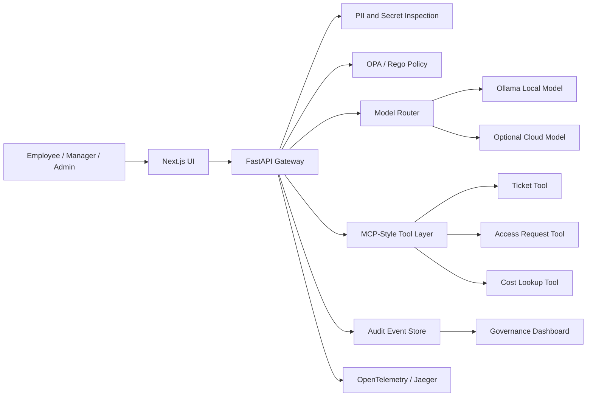

# AegisDesk CloudOps Control Plane

AegisDesk is a portfolio project for a policy-aware AI gateway in cloud operations. The goal is to show how an enterprise can let employees use AI for incident triage, access requests, ticket workflows, and cost investigation while enforcing privacy controls, role-based policy, model routing, approvals, audit logs, and cost visibility.

This repository currently contains the product definition, architecture, delivery plan, and implementation scaffolding. The first runnable milestone is a local Docker Compose demo with a Next.js frontend, FastAPI gateway, OPA policy checks, MCP-style tools, local model routing, redaction, and an admin governance dashboard.

## About

Most AI demos stop at generating an answer. AegisDesk focuses on the enterprise layer around the answer: who is allowed to ask, what data can leave the environment, which model should handle the request, which tools can be called, what needs approval, what it costs, and how the decision is audited.

The demo is designed around a simple recruiter-friendly story:

> Employees get AI help for cloud operations. The company keeps control over privacy, access, cost, and accountability.

## Target Users

- Cloud operations engineers triaging incidents and support requests
- Platform engineers building safe internal AI workflows
- Security and compliance reviewers auditing AI usage
- Engineering managers approving scoped operational actions
- FinOps teams tracking cloud and AI spend

## Core Use Cases

- **Cloud incident triage:** summarize logs, detect secrets, search runbooks, and recommend next steps.
- **Access request governance:** deny unsafe production admin requests and route safer alternatives for approval.
- **Cost-aware model routing:** choose local or cloud models based on sensitivity, budget, and route policy.
- **Ticket automation:** create or check tickets through policy-gated MCP-style tools.
- **Governance dashboard:** show model usage, cost estimates, redactions, denied actions, approvals, and tool calls.

## Tech Stack

This is the planned MVP stack reflected by the current scaffolding and documentation:

| Area | Choice | Purpose |
| --- | --- | --- |
| Frontend | Next.js | Employee chat, manager approvals, admin dashboard |
| API | FastAPI, Pydantic | Gateway endpoints, schemas, OpenAPI contracts |
| Policy | OPA, Rego | Authorization, model routing, approval, and budget rules |
| AI routing | Ollama local model, optional cloud provider adapter | Local-first demo with optional cloud route |
| Tooling | MCP-style Python tool layer | Ticket, access request, cost lookup, and knowledge search tools |
| Observability | OpenTelemetry, Jaeger | Request traces and operational visibility |
| Data | SQLite for MVP, Postgres path documented | Audit events and dashboard summaries |
| Runtime | Docker Compose | Low-cost reproducible local demo |
| Cloud path | Terraform/OpenTofu, Helm | Production deployment path without requiring always-on cloud spend |
| CI | GitHub Actions | Documentation checks now, implementation checks as code lands |

## Engineering Highlights

- **Policy outside the model:** OPA/Rego is the authority for tool use, access requests, routing, and approvals.
- **Local-first cost control:** the primary demo path is designed to run locally with Ollama and Docker Compose.
- **Sensitive-data handling before model calls:** PII and secret detection are planned as pre-routing controls, not UI-only warnings.
- **Auditable AI workflow:** each request should produce events for redaction, route choice, policy result, tool call, approval, cost estimate, and trace ID.
- **Safe portfolio boundaries:** destructive cloud actions are mocked or approval-only in the MVP, with a production hardening path documented separately.
- **Cloud role alignment:** the project emphasizes containers, policy-as-code, identity boundaries, observability, FinOps thinking, CI/CD, and deployable architecture.

## Architecture

The system is organized as a gateway between users, models, policies, tools, and audit storage.



Architecture docs:

- [Architecture Overview](docs/architecture.md)
- [System Architecture](docs/architecture/system-architecture.md)
- [API Contracts](docs/architecture/api-contracts.md)
- [Audit Event Model](docs/architecture/audit-event-model.md)
- [ADRs](docs/adrs/README.md)
- [Threat Model](docs/security/threat-model.md)
- [Governance Model](docs/security/governance-model.md)

## Current Status

Completed:

- Product framing and target users
- Recruiter and hiring manager positioning
- Use cases and demo script
- Architecture and API contracts
- Audit event model
- Governance and threat model
- Cost strategy and two-week MVP plan
- GitHub Actions documentation scaffold check

Next implementation milestone:

- Next.js chat and governance dashboard
- FastAPI `/chat` endpoint and event APIs
- OPA policy integration
- Mock MCP-style ticket, access, and cost tools
- Local redaction and model-routing logic
- Docker Compose runtime

## Repository Structure

```text
apps/web/                 Frontend app workspace
services/api/             Gateway API workspace
services/mcp-tools/       MCP-style tool service workspace
policies/                 OPA/Rego policy workspace
evals/                    Safety and policy evaluation workspace
infra/docker/             Local Docker runtime assets
infra/terraform/          Optional cloud IaC path
infra/helm/               Optional Kubernetes packaging path
docs/product/             Product framing, users, use cases, demo spec
docs/architecture/        Detailed system docs, API contracts, audit model
docs/adrs/                Architecture decision records
docs/security/            Governance model and threat model
docs/delivery/            MVP plan, cost strategy, review checklist
```

## Run Status

There is no live demo or runnable application yet. The repo is intentionally starting with clear documentation and implementation boundaries before code is added.

## Validation

Current CI verifies that required documentation files exist. As implementation lands, CI should expand to include:

- API tests
- OPA policy tests
- frontend checks
- container build checks
- Terraform/OpenTofu validation
- Helm template validation

Local checks used for this scaffold:

```bash
git diff --check
```

## Market Signal

This project is aligned with current cloud and AI infrastructure demand:

- CNCF's 2026 cloud native survey reports Kubernetes as a foundation for production AI workloads, with 82% of container users running Kubernetes in production and 66% of organizations hosting generative AI models using Kubernetes for inference workloads.
- The FinOps Foundation's 2026 report identifies AI cost management as the top forward-looking FinOps skill and says 98% of respondents now manage AI spend.

Sources:

- https://www.cncf.io/announcements/2026/01/20/kubernetes-established-as-the-de-facto-operating-system-for-ai-as-production-use-hits-82-in-2025-cncf-annual-cloud-native-survey/
- https://data.finops.org/

