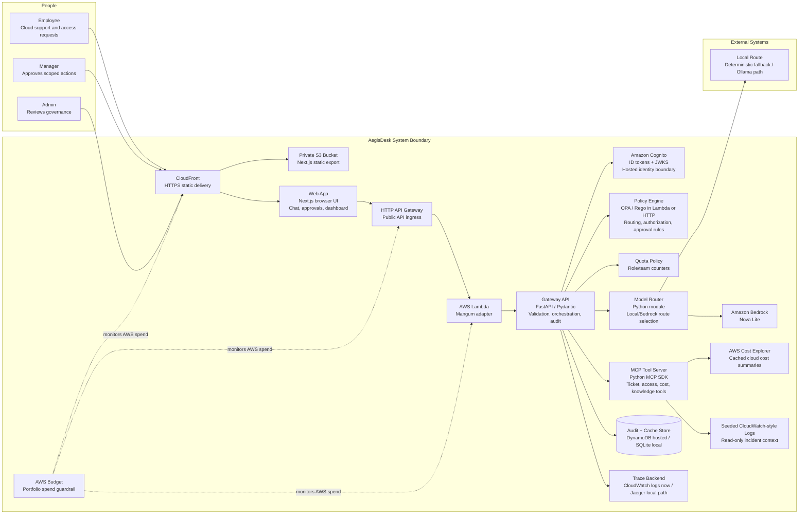

# Architecture Overview

AegisDesk is a local-first and hosted portfolio implementation of a CloudOps AI control plane. The current system sends employee, manager, and admin workflows through a FastAPI gateway that verifies Cognito ID tokens through JWKS, performs redaction, calls OPA/Rego policy, selects a model route, invokes Amazon Bedrock for approved low-sensitivity prompts, authorizes governed tools, handles approvals, loads seeded CloudWatch-style incident context, queries AWS Cost Explorer for manager/admin cost investigations, emits OpenTelemetry spans, and writes audit/cache state to DynamoDB in the hosted environment.

## Container Diagram

## Runtime Flow

1. A user submits a CloudOps request through the web app.
2. The FastAPI gateway validates the bearer token and derives user, role, and team from Cognito/JWKS claims.
3. The gateway inspects input for PII, secrets, and privileged-action intent.
4. OPA/Rego evaluates whether the request can use a model, call a tool, or needs approval.
5. The model router chooses a local/deterministic route or Amazon Bedrock based on sensitivity, budget, and policy.
6. For incident triage, the gateway loads read-only incident evidence from a seeded CloudWatch Logs-style source and records the lookup as a governed tool call.
7. If a tool action is requested, the gateway validates the structured action and checks policy before execution.
8. The gateway writes audit events for redaction, policy, model route, incident context, tool calls, approvals, estimated cost, and trace IDs.
9. The frontend shows the answer and decision metadata to the user, manager, or admin in plain English, with technical policy IDs underneath.

## Deployment Shape

### Current Repository State

The repository contains a runnable local frontend and API, Cognito/JWKS auth in AWS, Rego policy files and tests, CI checks, API tests, MCP server, documentation, screenshots, Docker Compose, applied AWS Terraform for the hosted portfolio deployment, and a manual GitHub Actions deploy workflow.

### MVP Deployment

The verified local development path is direct process execution:

- `services/api`: FastAPI gateway on port 8000
- `apps/web`: Next.js frontend on port 3000

The Docker Compose path is available when Docker is installed:

- `apps/web`: Next.js frontend
- `services/api`: FastAPI gateway
- `opa`: OPA server loaded from the Rego policy bundle
- local model route simulator, with Ollama path documented
- SQLite audit events for MVP
- Jaeger for trace viewing through OTLP HTTP export

### Hosted Portfolio Deployment

The current hosted deployment uses a low-idle-cost AWS shape:

- private S3 bucket and CloudFront distribution for the static frontend
- FastAPI Lambda zip package behind HTTP API Gateway
- Amazon Cognito user pool, app client, role groups, and JWKS verification
- DynamoDB table for durable audit events, approvals, model routes, metrics, quotas, and Cost Explorer cache entries
- Amazon Bedrock Nova Lite for approved low-sensitivity prompts
- AWS Cost Explorer for manager/admin cost investigations
- seeded CloudWatch Logs-style incident context for checkout latency triage
- IAM execution role scoped to CloudWatch log writes, DynamoDB state, Cognito persona issuance, Bedrock invocation, and Cost Explorer reads
- CloudWatch log group with seven-day retention
- AWS Budget guardrail set to the portfolio threshold
- S3 server-side encryption, public access block, and noncurrent version cleanup
- S3-backed Terraform state for manual GitHub Actions deployment

### Production Hardening Path

The hosted deployment intentionally stays below production complexity. A production version would add:

- future managed Postgres
- enterprise identity federation with Entra ID, Okta, or an existing corporate IdP
- immutable or append-only audit sink
- scoped IAM roles for any real cloud tools

## Key Constraints

- The current system must distinguish real provider calls from deterministic fallback behavior.
- Destructive cloud actions are mocked or approval-only in the portfolio MVP.
- Policy must be enforced outside the model.
- Sensitive data controls happen before model routing.
- Cloud model use must be optional so the app can run at low cost.
- Audit events must be based on backend decisions, not invented dashboard values.
- Operational context shown in the hosted portfolio must be read-only and low-cost.

## Related Docs

- [System Architecture](architecture/system-architecture.md)
- [API Contracts](architecture/api-contracts.md)
- [Audit Event Model](architecture/audit-event-model.md)
- [Governance Model](security/governance-model.md)
- [Threat Model](security/threat-model.md)
- [ADRs](adrs/README.md)
