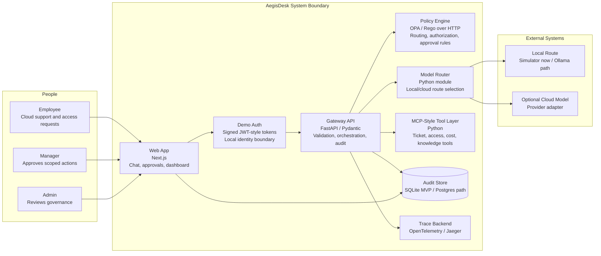

# Architecture Overview

AegisDesk is a local-first MVP for a CloudOps AI control plane. The current implementation sends employee, manager, and admin workflows through a FastAPI gateway that verifies signed demo tokens, performs redaction, calls OPA/Rego policy, selects a model route, authorizes mock tools, handles approvals, emits OpenTelemetry spans, and writes audit events.

## Container Diagram

## Runtime Flow

1. A user submits a CloudOps request through the web app.
2. The FastAPI gateway validates the bearer token and derives user, role, and team from signed claims.
3. The gateway inspects input for PII, secrets, and privileged-action intent.
4. OPA/Rego evaluates whether the request can use a model, call a tool, or needs approval.
5. The model router chooses local Ollama or an optional cloud provider based on sensitivity, budget, and policy.
6. If a tool action is requested, the gateway validates the structured action and checks policy before execution.
7. The gateway writes audit events for redaction, policy, model route, tool calls, approvals, estimated cost, and trace IDs.
8. The frontend shows the answer and decision metadata to the user, manager, or admin.

## Deployment Shape

### Current Repository State

The repository contains a runnable local frontend and API, signed demo auth, Rego policy files and tests, CI checks, API tests, documentation, screenshots, Docker Compose, and plan-only AWS Terraform.

### MVP Deployment

The verified local development path is direct process execution:

- `services/api`: FastAPI gateway on port 8000
- `apps/web`: Next.js frontend on port 3000

The Docker Compose path is available when Docker is installed:

- `apps/web`: Next.js frontend
- `services/api`: FastAPI gateway
- `opa`: OPA server loaded from the Rego policy bundle
- local model route simulator, with Ollama path documented
- SQLite audit events for MVP
- Jaeger for trace viewing through OTLP HTTP export

### Production Path

The production path is partially modeled as plan-only Terraform and not applied:

- S3 and CloudFront static frontend
- Lambda container API behind HTTP API Gateway
- ECR, IAM, CloudWatch logs, Secrets Manager reference, and AWS Budget
- future managed Postgres
- future OIDC/JWKS identity provider integration
- immutable or append-only audit sink
- scoped IAM roles for any real cloud tools

## Key Constraints

- The current demo must not claim paid model calls or real cloud writes.
- Destructive cloud actions are mocked or approval-only in the portfolio MVP.
- Policy must be enforced outside the model.
- Sensitive data controls happen before model routing.
- Cloud model use must be optional so the demo can run at low cost.
- Audit events must be based on backend decisions, not invented dashboard values.

## Related Docs

- [System Architecture](architecture/system-architecture.md)
- [API Contracts](architecture/api-contracts.md)
- [Audit Event Model](architecture/audit-event-model.md)
- [Governance Model](security/governance-model.md)
- [Threat Model](security/threat-model.md)
- [ADRs](adrs/README.md)
