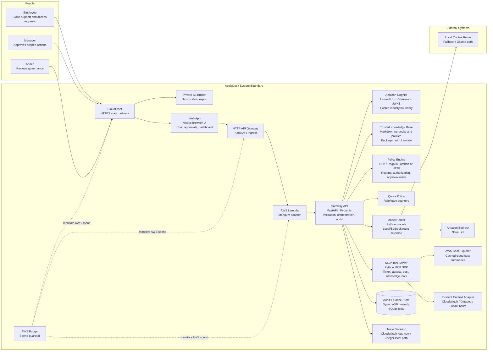

# Architecture Overview

AegisDesk is a self-hosted CloudOps AI control plane. The system sends employee, manager, and admin workflows through a FastAPI gateway that exchanges Cognito Hosted UI authorization codes, verifies Cognito ID tokens through JWKS, performs redaction, retrieves trusted runbook or governance policy excerpts, calls OPA/Rego policy, selects a model route, invokes Amazon Bedrock for approved low-sensitivity prompts, authorizes governed tools, handles approvals, loads read-only incident context, queries AWS Cost Explorer for manager/admin cost investigations, emits OpenTelemetry spans, and writes audit/cache state to DynamoDB in the hosted environment.

## Container Diagram

## Runtime Flow

1. A user submits a CloudOps request through the web app.
2. The user signs in through Cognito Hosted UI or uses a labeled identity shortcut for local review.
3. The FastAPI gateway validates the bearer token and derives user, role, and team from Cognito/JWKS claims.
4. The gateway inspects input for PII, secrets, and privileged-action intent.
5. The gateway evaluates whether the request has the minimum required context for the requested action. Vague incident requests can receive safe first-step guidance, while ticket, access, and cost tool calls pause until required fields are present.
6. The gateway retrieves trusted knowledge excerpts from packaged runbooks and governance policies based on request intent.
7. OPA/Rego evaluates whether the request can use a model, call a tool, or needs approval.
8. The model router chooses a local control route or Amazon Bedrock based on sensitivity, budget, policy, and clarification status.
9. For incident triage, the gateway loads read-only incident evidence through the incident context adapter only when the request supplies a usable incident reference.
10. If a tool action is requested, the gateway validates the structured action and checks policy before execution.
11. The gateway calculates an answer trust score from trusted source presence, source freshness, external model use, sensitive-data routing, and policy result.
12. The gateway writes audit events and a sanitized replay snapshot for redaction, clarification, policy input/output, model route, incident context, tool calls, approvals, answer sources, estimated cost, and trace IDs.
13. The frontend shows the answer, trusted citations, decision metadata, clarification status, trust score, and request replay to the user, manager, or admin in plain English, with technical policy IDs underneath.

## Deployment Shape

### Current Repository State

The repository contains a runnable local frontend and API, Cognito/JWKS auth in AWS, Rego policy files and tests, CI checks, API tests, MCP server, documentation, screenshots, Docker Compose, applied AWS Terraform for the hosted deployment, and a manual GitHub Actions deploy workflow.

### Local Deployment

The verified local development path is direct process execution:

- `services/api`: FastAPI gateway on port 8000
- `apps/web`: Next.js frontend on port 3000

The Docker Compose path is available when Docker is installed:

- `apps/web`: Next.js frontend
- `services/api`: FastAPI gateway
- `opa`: OPA server loaded from the Rego policy bundle
- local control route, with Ollama path documented
- SQLite audit events
- Jaeger for trace viewing through OTLP HTTP export

### Hosted AWS Deployment

The current hosted deployment uses a low-idle-cost AWS shape:

- private S3 bucket and CloudFront distribution for the static frontend
- FastAPI Lambda zip package behind HTTP API Gateway with default route throttling
- Amazon Cognito user pool, Hosted UI domain, app client, role groups, OAuth code flow with PKCE, and JWKS verification
- DynamoDB table for durable audit events, approvals, model routes, metrics, quotas, and Cost Explorer cache entries
- Amazon Bedrock Nova Lite for approved low-sensitivity prompts
- Runtime guardrails for per-role quotas, prompt size limits, and cloud-model kill switch routing
- risk-based clarification before governed tool execution
- AWS Cost Explorer for manager/admin cost investigations
- packaged Markdown knowledge base for checkout triage, production access control, and AI/cloud cost governance
- local fixture incident context for first-run evaluation, plus a bounded CloudWatch Logs adapter for customer incident evidence
- IAM execution role scoped to CloudWatch log writes, DynamoDB state, Cognito persona issuance, Bedrock invocation, and Cost Explorer reads
- CloudWatch log group with seven-day retention
- AWS Budget guardrail set to the configured threshold
- S3 server-side encryption, public access block, and noncurrent version cleanup
- S3-backed Terraform state for manual GitHub Actions deployment

### Production Hardening Path

The hosted deployment intentionally stays below production complexity. A production version would add:

- future managed Postgres
- enterprise identity federation with Entra ID, Okta, or an existing corporate IdP
- immutable or append-only audit sink
- scoped IAM roles for any real cloud tools

## Key Constraints

- The current system must distinguish external provider calls from local control fallback behavior.
- Destructive cloud actions should stay behind approval and customer change-management controls.
- Policy must be enforced outside the model.
- Vague requests must be handled safely without silently inventing operational scope.
- Sensitive data controls happen before model routing.
- Cloud model use must be optional so the app can run at low cost.
- Audit events must be based on backend decisions, not invented dashboard values.
- Operational context in the hosted environment must be read-only and low-cost.

## Related Docs

- [System Architecture](architecture/system-architecture.md)
- [API Contracts](architecture/api-contracts.md)
- [Audit Event Model](architecture/audit-event-model.md)
- [Governance Model](security/governance-model.md)
- [Threat Model](security/threat-model.md)
- [ADRs](adrs/README.md)
