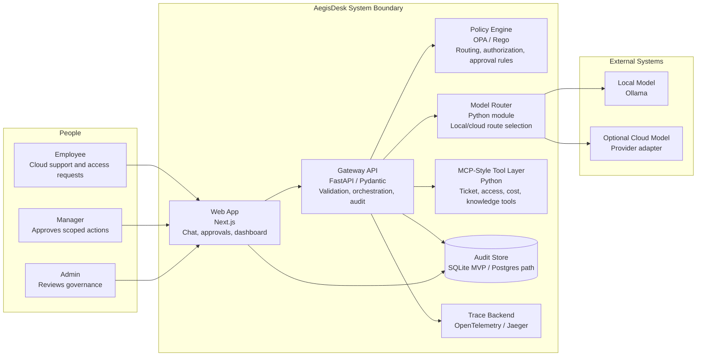

# Architecture Overview

AegisDesk is currently a documentation-first scaffold for a CloudOps AI control plane. The intended MVP is a local-first system where a frontend sends employee, manager, and admin workflows through a FastAPI gateway that performs redaction, policy evaluation, model routing, tool authorization, audit logging, and observability.

## Container Diagram

## Runtime Flow

1. A user submits a CloudOps request through the web app.
2. The FastAPI gateway validates the request and attaches user, role, team, and request context.
3. The gateway inspects input for PII, secrets, and privileged-action intent.
4. OPA/Rego evaluates whether the request can use a model, call a tool, or needs approval.
5. The model router chooses local Ollama or an optional cloud provider based on sensitivity, budget, and policy.
6. If a tool action is requested, the gateway validates the structured action and checks policy before execution.
7. The gateway writes audit events for redaction, policy, model route, tool calls, approvals, estimated cost, and trace IDs.
8. The frontend shows the answer and decision metadata to the user, manager, or admin.

## Deployment Shape

### Current Repository State

The repository is a scaffold. It contains documentation, contracts, CI documentation checks, and workspaces for the planned application services.

### MVP Deployment

The first runnable target is Docker Compose:

- `apps/web`: Next.js frontend
- `services/api`: FastAPI gateway
- `services/mcp-tools`: MCP-style tool service
- `policies`: OPA/Rego policy bundle
- local model route through Ollama
- SQLite or Postgres for audit events
- Jaeger for trace viewing

### Production Path

The production path is documented but not implemented yet:

- Kubernetes deployment with Helm
- Terraform/OpenTofu for cloud resources
- managed Postgres
- cloud identity provider integration
- managed secrets
- immutable or append-only audit sink
- scoped IAM roles for any real cloud tools

## Key Constraints

- The current repo must not claim a live app until the app exists.
- Destructive cloud actions are mocked or approval-only in the portfolio MVP.
- Policy must be enforced outside the model.
- Sensitive data controls happen before model routing.
- Cloud model use must be optional so the demo can run at low cost.
- Audit events must be based on backend decisions, not invented dashboard values.

## Related Docs

- [System Architecture](architecture/system-architecture.md)
- [API Contracts](architecture/api-contracts.md)
- [Audit Event Model](architecture/audit-event-model.md)
- [Governance Model](security/governance-model.md)
- [Threat Model](security/threat-model.md)
- [ADRs](adrs/README.md)
