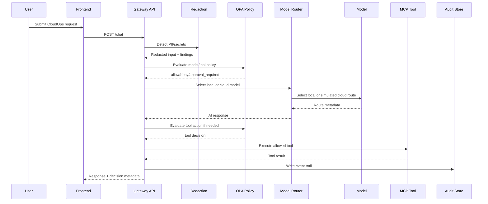

# System Architecture

## Design Goal

AegisDesk is designed as a control plane for enterprise AI workflows, not a standalone chatbot.

Core responsibilities:

- Authenticate user and role
- Inspect request for sensitive data
- Evaluate policy before model and tool calls
- Route to the correct model
- Call approved tools through a controlled interface
- Record audit events and traces
- Surface decisions in an admin dashboard

## Logical Components

### Frontend

Views:

- Employee chat
- Manager approval queue
- Admin governance dashboard

Responsibilities:

- Present AI responses and workflow state
- Show clear policy, redaction, and route indicators
- Provide non-technical visibility into enterprise controls

### Gateway API

Stack: FastAPI + Pydantic.

Responsibilities:

- Request validation
- User/role context
- Redaction pipeline
- Policy checks
- Model routing
- Tool orchestration
- Audit event creation
- OpenAPI documentation

### Policy Engine

Stack: Rego policy files with mirrored Python enforcement in the current API.

Policy decisions:

- Can user call this tool?
- Can this request use a cloud model?
- Does this action require approval?
- Is this resource allowed for this role?
- Is the request over budget?

### Model Router

MVP routing rules:

- Public and low-risk requests can use the simulated cloud route.
- Sensitive requests route to the local route.
- Requests with secrets can be blocked or redacted before routing.
- Budget threshold can force lower-cost routes.

Production extension:

- Provider health checks
- Latency-aware routing
- Quality eval routing
- Tenant/team budgets
- Fallback strategy

### MCP Tool Layer

MVP tools:

- Ticket tool
- Access request tool
- Cloud cost lookup tool
- Knowledge search tool

Tool safety pattern:

1. Convert user request into structured intent.
2. Validate schema.
3. Evaluate policy.
4. Execute tool only if allowed.
5. Log inputs, outputs, and decision.

### Audit Store

MVP storage: in-memory demo state. Production path: SQLite/Postgres and immutable audit sink.

Events:

- request.received
- pii.detected
- secret.detected
- model.route.selected
- policy.allowed
- policy.denied
- approval.requested
- approval.granted
- tool.called
- eval.failed

### Observability

Current MVP: trace IDs in audit events. Production path: OpenTelemetry + Jaeger.

Trace spans:

- HTTP request
- Redaction
- Policy evaluation
- Model route decision
- Model call
- Tool call
- Audit write

## Request Flow

## Deployment Shape

### Local MVP

- Docker Compose
- Next.js frontend
- FastAPI gateway
- optional OPA container
- optional Jaeger

### Production Path

- Kubernetes
- Helm chart
- Managed Postgres
- Managed secrets
- Cloud identity provider
- Object storage for reports
- OpenTelemetry collector
- CI/CD promotion workflow

## Deliberate MVP Boundaries

The MVP should not pretend to modify real cloud resources. Destructive actions are mocked or approval-only.

This is intentional:

- Safer for a portfolio demo
- Lower cost
- Easier to run locally
- Still demonstrates the enterprise control pattern
