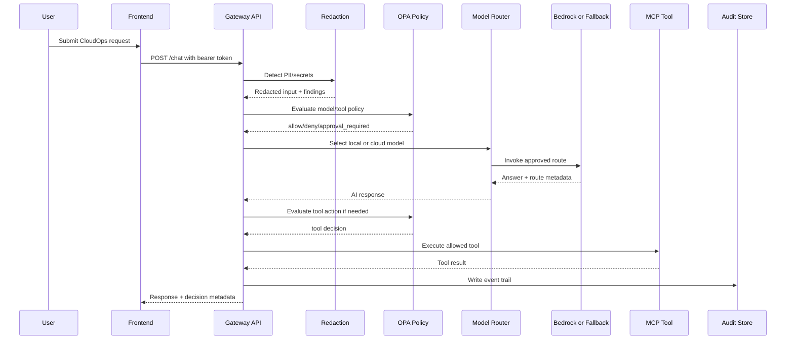

# System Architecture

## Design Goal

AegisDesk is designed as a control plane for enterprise AI workflows, not a standalone chatbot.

Core responsibilities:

- Authenticate user and role
- Inspect request for sensitive data
- Evaluate policy before model and tool calls
- Route to the correct model
- Call approved tools through a controlled interface
- Record audit events and traces
- Surface decisions in an admin dashboard

## Logical Components

### Frontend

Views:

- Employee chat
- Manager approval queue
- Admin governance dashboard

Responsibilities:

- Present AI responses and workflow state
- Show clear policy, redaction, and route indicators
- Provide non-technical visibility into enterprise controls

### Demo Auth Boundary

The local demo can use HMAC-signed bearer tokens for fast tests. The hosted portfolio environment issues RS256 demo tokens from `/auth/demo-token` and verifies them with the public key exposed at `/.well-known/jwks.json`. The API derives `user_id`, `role`, and `team` from token claims and ignores role fields sent in chat request bodies.

Production extension:

- OIDC/JWKS verification from Cognito, Entra ID, Okta, or another identity provider
- short token TTLs
- tenant and group claims
- separate admin-only operations

### Gateway API

Stack: FastAPI + Pydantic.

Responsibilities:

- Request validation
- User/role context from signed token claims
- Redaction pipeline
- Policy checks
- Model routing
- Tool orchestration
- Audit event creation
- OpenAPI documentation

### Policy Engine

Stack: OPA/Rego over HTTP in Docker Compose, with an explicit Python fallback for direct local runs and tests.

Policy decisions:

- Can user call this tool?
- Can this request use a cloud model?
- Does this action require approval?
- Is this resource allowed for this role?
- Is the request over budget?

### Model Router

MVP routing rules:

- Public and low-risk requests can use Amazon Bedrock Nova Lite.
- Sensitive requests route to the local route.
- Requests with secrets can be blocked or redacted before routing.
- Budget threshold can force lower-cost routes.
- If Bedrock is disabled or unavailable, deterministic fallback keeps the demo usable.

Production extension:

- Provider health checks
- Latency-aware routing
- Quality eval routing
- Tenant/team budgets
- Fallback strategy

### MCP Tool Layer

MVP tools:

- Ticket tool
- Access request tool
- Cloud cost lookup tool
- Knowledge search tool

The repository includes a real MCP server in `services/mcp-tools` using the Python MCP SDK. The hosted Lambda API uses an in-process adapter for the same deterministic demo actions to avoid spawning subprocesses in Lambda.

Tool safety pattern:

1. Convert user request into structured intent.
2. Validate schema.
3. Evaluate policy.
4. Execute tool only if allowed.
5. Log inputs, outputs, and decision.

### Audit Store

Hosted storage: DynamoDB single-table demo state. Local fallback: SQLite. Production path: managed Postgres or a stricter immutable audit sink, depending on retention and reporting requirements.

Events:

- request.received
- pii.detected
- secret.detected
- model.route.selected
- policy.allowed
- policy.denied
- approval.requested
- approval.granted
- tool.called
- eval.failed

### Observability

Current MVP: OpenTelemetry FastAPI instrumentation, request spans, structured JSON request logs, trace IDs in audit events, and a local Jaeger OTLP path through Docker Compose.

Trace spans:

- HTTP request
- Redaction
- Policy evaluation
- Model route decision
- Model call
- Tool call
- Audit write

### Quotas

Per-role/team quota counters are enforced before model or tool execution. Policy defines daily limits by role, and the store records counters in SQLite locally or DynamoDB in AWS.

## Request Flow

## Deployment Shape

### Local MVP

- Docker Compose
- Next.js frontend
- FastAPI gateway
- OPA container
- Jaeger
- persistent local SQLite volume

### Hosted AWS Demo

- Terraform-provisioned private S3 bucket behind CloudFront for the static frontend
- FastAPI packaged as a Lambda zip with Mangum behind HTTP API Gateway
- DynamoDB table for audit events, approvals, route history, metrics, and quotas
- Bedrock Nova Lite invocation for approved low-sensitivity prompts
- IAM role scoped to Lambda log writes
- CloudWatch log group with seven-day retention
- S3 server-side encryption, public access block, and noncurrent version cleanup
- AWS Budget guardrail for the portfolio cost threshold
- S3 remote Terraform state for manual GitHub Actions deployment

### Production Hardening Path

- Optional Helm chart if target roles require Kubernetes
- Managed Postgres or immutable audit storage
- Managed secrets and real identity provider
- OpenTelemetry collector or managed trace sink
- CI/CD promotion workflow

## Deliberate MVP Boundaries

The MVP should not pretend to modify real cloud resources. Destructive actions are mocked or approval-only.

This is intentional:

- Safer for a portfolio demo
- Lower cost
- Easier to run locally
- Still demonstrates the enterprise control pattern
