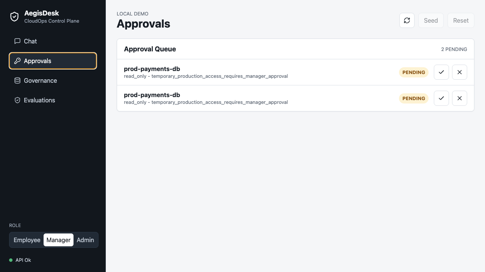

# Demo Evidence

These screenshots are captured from the local app. They are intended for recruiter and hiring-manager scanning before a live hosted deployment exists.

## Walkthrough

1. Start the API and web app locally.
2. Switch to the `Admin` demo role and click `Seed`.
3. Open `Governance` to show audit events, cost estimates, redactions, denied actions, pending approvals, and tool calls.
4. Switch to `Employee`, open `Chat`, and run the access request prompt.
5. Switch to `Manager`, open `Approvals`, and show the pending scoped access decision.

## Screenshots

## Boundary

The demo does not call paid model providers and does not create or modify AWS resources. The AWS Terraform in `infra/terraform` is plan-only until deployment cost approval.
