# Architecture Diagram

```mermaid
flowchart LR
    Employee["Employee / Manager / Admin"] --> Web["Next.js Control Plane UI"]
    Web --> API["FastAPI Gateway"]
    API --> Auth["Cognito / OIDC / JWKS"]
    API --> Redaction["Secret + PII Redaction"]
    API --> Policy["OPA / Rego"]
    API --> Knowledge["Runbooks + Policies"]
    API --> Router["Model Router"]
    Router --> Bedrock["AWS Bedrock"]
    Router --> Local["Local Control Fallback"]
    API --> Tools["Adapter Layer"]
    Tools --> Tickets["Jira / ServiceNow / Local Ticket"]
    Tools --> Logs["CloudWatch / Datadog / Local Fixture"]
    Tools --> Access["Okta / IAM Identity Center / Local Approval"]
    API --> Cost["AWS Cost Explorer"]
    API --> Store["DynamoDB Audit + Cache"]
    API --> Trace["OpenTelemetry"]
    Store --> Replay["Request Replay"]
    Tools --> MCP["MCP Server"]
```

## Runtime Flow

1. User signs in through SSO or controlled local persona.
2. API verifies identity and role/team claims.
3. Prompt is redacted before model routing.
4. OPA/Rego evaluates chat, route, tool, quota, and approval policy.
5. Approved low-risk requests may use Bedrock.
6. Tools run through adapters only after policy allows them.
7. Audit events, route records, approvals, and cache entries are persisted.
8. Governance reviewers inspect request replay by request ID or trace ID.
